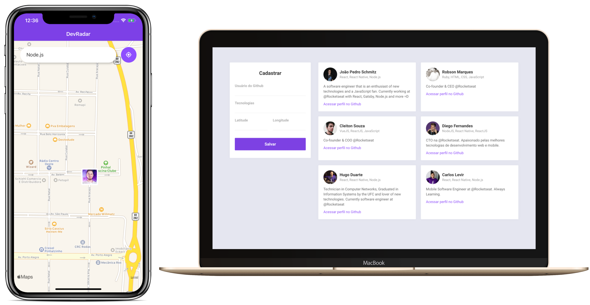

<h1 align="center">
    
</h1>

  

  
  
  

  

  

  <a href="#rocket-technologies">Technologies</a>&nbsp;&nbsp;&nbsp;|&nbsp;&nbsp;&nbsp;
  <a href="#-project">Project</a>&nbsp;&nbsp;&nbsp;|&nbsp;&nbsp;&nbsp;
  <a href="#-layout">Layout</a>&nbsp;&nbsp;&nbsp;|&nbsp;&nbsp;&nbsp;
  <a href="#memo-license">License</a>

 

  

## :rocket: Technologies

Technologies used in the project:

- [Node.js](https://nodejs.org/en/)
- [React](https://reactjs.org)
- [React Native](https://facebook.github.io/react-native/)
- [Expo](https://expo.io/)

## 💻 Project

DevRadar is a project that aims to connect developers with customers through the locality.

## 🔖 Layout

You can download the project layout in `.sketch` format via [desse link](.github/DevRadar.sketch).

To open the file in `.sketch` format on any operating system use the tool [Figma](https://figma.com).

## :memo: License

This project is under the MIT license. See the file [LICENSE](https://github.com/felipehonoratods/dev-radar/blob/master/LICENSE) for more details.
